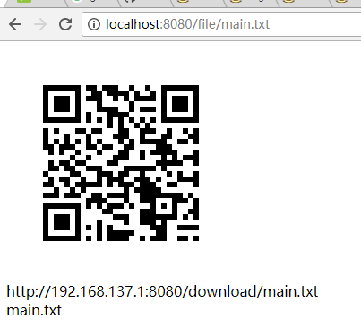

# FileAnywhere

[Local area network, file sharing, golang, beego]
[局域网 文件分享 golang beego]

上网找了好久，没有找到一个称心的局域网文件共享软件。晚上自己搞了这么个东西

## 使用方法
* 下载文件[FileAnywhere](https://github.com/ExFly/FileAnywhere/releases/download/v0.0.0/FileAnywhere.tar.gz)
* 确保电脑和手机在同一个局域网中
* 将要共享的文件复制到_FILE文件夹下
* 启动服务器，在url的最后输入要共享文件的名字例如：http://localhost:8080/file/main.txt
* 点回车后会显示二维码，此时可以直接用手机扫二维码，即可开始下载文件

## 注：
* 对于其他操作系统的用户，可下载下来进行编译
* 配置golang环境
* 增加 GOPATH 变量为当前项目根目录
* 安装依赖项
* bee pack
* 打包好的软件在src\FileAnywhere\FileAnywhere.tar.gz

## 依赖项
* github.com/astaxie/beego
* github.com/beego/bee
* github.com/skip2/go-qrcode

## TODO list
* 当前为了自己使用，没有做很好看的界面
* 对二维码进行重命名，以达到多用户可以使用的要求
